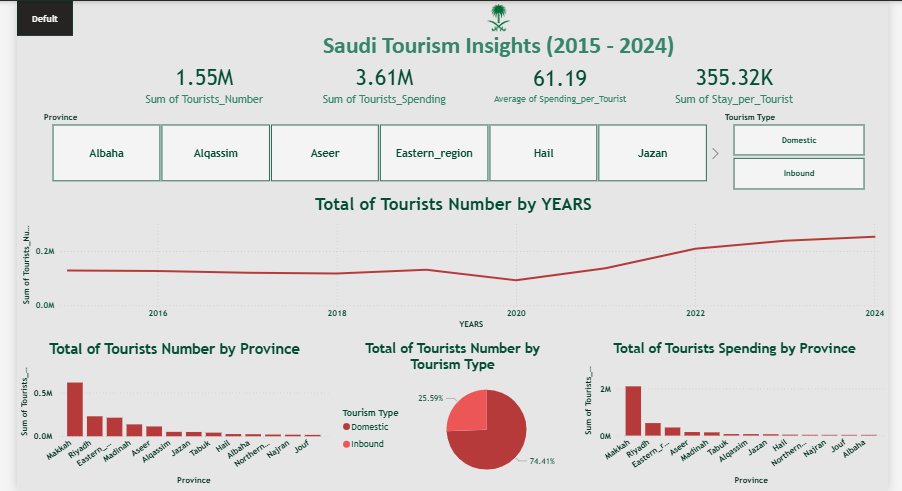
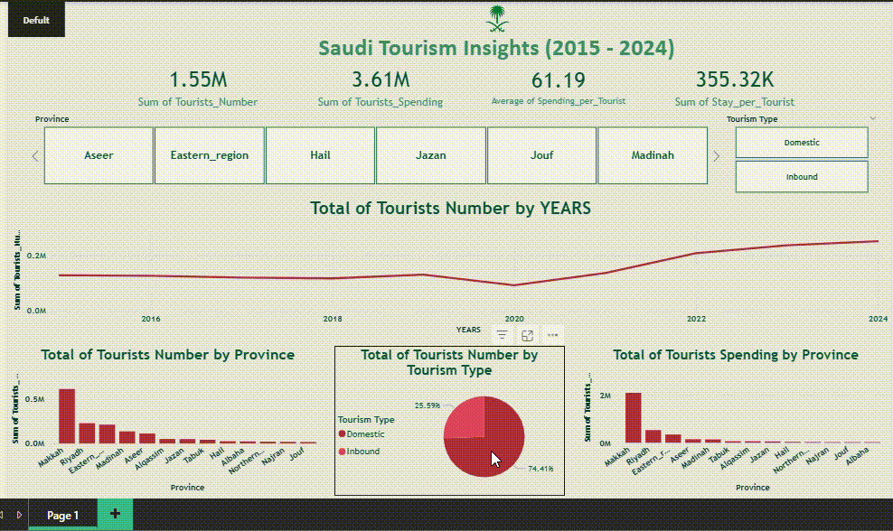

# Saudi Tourism Insights Dashboard (2015–2024)

## Dashboard Preview

## Interactive Demo

## Overview
Built an end-to-end data analytics project to analyze tourism trends in Saudi Arabia, focusing on regional performance, spending behavior, and the impact of COVID-19.

---

## Data Source
Tourism dataset covering Saudi regions (2015–2024)  
Source: https://www.kaggle.com/datasets/toobaik/saudi-arabia-tourism-dataset-20152024?select=tourism_data.csv
---

## Tech Stack
- Python  
  - Pandas for data cleaning and transformation  
  - NumPy for feature engineering  
  - Matplotlib and Seaborn for exploratory analysis  

- Power BI  
  - Interactive dashboard development  
  - Data modeling (Star Schema)  
  - DAX measures (YoY Growth, Tourism Share %)

---

## Data Modeling
Designed a star schema by separating:
- Fact table (tourism metrics)  
- Dimension tables (province, tourism type, date)  

This improved performance and enabled efficient filtering across visuals.

---

## Data Preparation
- Removed 28 duplicate rows  
- Validated missing values  
- Handled zero-value records  
- Created new features:
  - Spending_per_Tourist  
  - Stay_per_Tourist  
  - Spending_per_Night  
  - Covid_Period classification  

---

## Dashboard Highlights
- KPI cards (Total Tourists, Total Spending, Average Stay)  
- Trend analysis over time  
- Regional comparison  
- Tourism type distribution (Domestic vs Inbound)  
- COVID impact visualization  

---

## Key Insights
- Makkah is the top tourism destination due to religious travel  
- Tourism declined during COVID and recovered strongly after 2022  
- Domestic tourism represents the majority of visitors  
- Strong relationship between spending and overnight stays  
- Clear variation in performance across regions  

---

## Key Metrics
- Year-over-Year Growth (YoY)  
- Tourism Share percentage by region  

---

## Business Value
This dashboard helps decision-makers to:
- Identify high-performing regions  
- Understand tourism patterns  
- Evaluate external impacts such as COVID  
- Support tourism planning and strategy  

---
